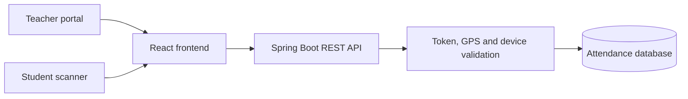

<div align="center">

# 📋 QR-Based GPS Attendance System

### Secure, location-verified classroom attendance powered by dynamic QR codes

A full-stack web application that automates classroom attendance using QR codes, real-time GPS verification, device fingerprinting, and a modern responsive interface for teachers and students.

</div>

## 🌐 Live Demo

**https://qr-attendance-80aq.onrender.com**

> First load may take 50 seconds if inactive. Please wait.

---

## ✨ Key Features

### Attendance and security

- 📱 Camera-based QR scanning directly from the browser — no application installation required
- 📍 GPS geo-fencing using the Haversine formula — attendance is accepted only within the configured radius
- 🔄 Dynamic QR refresh every 15 seconds for safer classroom check-ins
- 🔒 One-time QR tokens that prevent reuse of expired codes
- 📲 Device fingerprinting to block duplicate attendance from the same device
- 🚨 Suspicious-attempt logging with the failure reason and detected GPS coordinates
- 🔐 Teacher security-audit dashboard for reviewing flagged attempts
- ⚙️ Configurable GPS radius from 5 m strict mode to 500 m indoor-testing mode
- 📊 Thirty-day attendance analytics and session trends
- 👩‍🏫 Real-time present-student register that refreshes automatically

### Frontend Experience

- ⚛️ React-based single-page interface for authentication, teacher tools, and student scanning
- 🎨 Pastel 3D-inspired visual design with coordinated light and dark themes
- 🖱️ Pointer glow, click feedback, magnetic buttons, card-tilt effects, and animated icons
- ✨ Scroll progress, reveal animations, QR shimmer, scanner motion, and live status feedback
- 📱 Responsive layouts for desktops, tablets, and mobile devices
- ♿ Keyboard focus styles and reduced-motion support for improved accessibility
- 🌗 Persistent theme preference across sessions

---

## 🛠️ **TECHNOLOGY STACK**

### 🔒 **Backend and infrastructure**

| **Layer** | **Technology** |
|:---|:---|
| **Backend** | **Java 17, Spring Boot 3.5** |
| **Database** | **MySQL (local), PostgreSQL (production)** |
| **ORM** | **Spring Data JPA, Hibernate** |
| **Security** | **Spring Security, BCrypt** |
| **QR Generation** | **ZXing (Google)** |
| **Deployment** | **Render (Docker), GitHub** |

### 🎨 **Frontend**

| **Layer** | **Technology** |
|:---|:---|
| **Frontend** | **React 19, Vite, CSS3** |
| **Interface Icons** | **Lucide React** |
| **QR Scanning** | **html5-qrcode library** |
| **Analytics** | **Recharts** |
| **UI and Motion** | **Responsive layouts, light/dark themes, CSS animations, pointer and scroll effects** |

---

## 🧰 Skills & Tools

<div align="center">


<br>


</div>

---

## 📊 GitHub Stats

<div align="center">


<br/>


</div>
---

## 🧭 Application Flow



1. The teacher starts a session and the classroom GPS coordinates are saved.
2. The backend generates a UUID-based QR token that refreshes every 15 seconds.
3. The student scans the live QR code from the browser.
4. The frontend sends the token, GPS coordinates, student ID, and device fingerprint to the backend.
5. The backend validates all four conditions:
   - The token exists and has not already been used.
   - The token has not expired within the 20-minute session window.
   - The student is inside the configured radius using the Haversine formula.
   - The device has not already been used during the session.
6. Valid attendance is recorded, while failed attempts are stored in the security-audit log.
7. The teacher dashboard updates the present-student list and audit information in real time.

---

## 🖥️ Application Pages

| **Page** | **Purpose** | **Frontend experience** |
|:---|:---|:---|
| **Login / Register** | Role-based access for teachers and students | Animated authentication interface, password visibility controls, role selection, and theme support |
| **Teacher Overview** | Quick view of the active classroom session | Live QR hero, present-student count, security status, analytics preview, and real-time register |
| **Start Session** | Configure and launch attendance | GPS auto-detection, manual coordinates, configurable radius, and secure-flow guidance |
| **Present Students** | Monitor verified attendance | Automatically refreshed attendance table with verification status and scan time |
| **Security Audit** | Review unusual attempts | Flagged-attempt details, reasons, location data, and verified-student totals |
| **Analytics** | Understand participation trends | Thirty-day attendance chart, session totals, and average attendance |
| **Student Scanner** | Mark attendance using the device camera | Live camera scanner, GPS/device/network checklist, privacy guidance, and verification feedback |

---

## 🚀 Run Locally

### Prerequisites

- Java 17 or higher
- MySQL 8
- Maven 3.9

### Steps

1. Clone the repository:

   ```bash
   git clone https://github.com/BristiGhosh604/qr-attendance.git
   ```

2. Navigate to the Spring Boot project:

   ```bash
   cd qr-attendance/qr-attendance
   ```

3. Create the MySQL database:

   ```sql
   CREATE DATABASE qr_attendance;
   ```

4. Update `application.properties` with your MySQL credentials.

5. Start the application:

   ```bash
   mvn spring-boot:run
   ```

6. Open the application:

   ```text
   http://localhost:8080/index.html
   ```

The compiled React frontend is already included inside Spring Boot's static resources, so Node.js is not required to run the repository.

---

## 📁 Project Structure

```text
qr-attendance/
├── src/main/java/com/example/qr_attendance/
│   ├── controller/
│   │   ├── AuthController.java
│   │   ├── TeacherController.java
│   │   └── StudentController.java
│   ├── model/
│   │   ├── User.java
│   │   ├── Session.java
│   │   ├── Attendance.java
│   │   └── SuspiciousAttempt.java
│   ├── repository/
│   ├── service/
│   │   ├── AuthService.java
│   │   ├── QrService.java
│   │   └── GeoFenceService.java
│   └── config/
│       └── SecurityConfig.java
├── src/main/resources/
│   ├── application.properties
│   └── static/
│       ├── index.html          # Compiled React entry point
│       ├── teacher.html        # Teacher compatibility redirect
│       ├── student.html        # Student compatibility redirect
│       └── assets/             # Compiled JavaScript and CSS bundles
├── Dockerfile
├── render.yaml
└── pom.xml
```

---

## 🔐 Security Summary

| **Protection** | **Purpose** |
|:---|:---|
| **Dynamic QR token** | Limits the usefulness of copied or outdated QR codes |
| **Single-use validation** | Prevents a token from recording attendance more than once |
| **Token expiration** | Rejects codes outside the active session window |
| **GPS geo-fencing** | Confirms that the student is near the configured classroom location |
| **Device fingerprinting** | Reduces duplicate or proxy attendance from one device |
| **Suspicious-attempt audit** | Records failed verification attempts for teacher review |

---

<div align="center">

### Built for faster, safer, and more engaging classroom attendance

</div>
